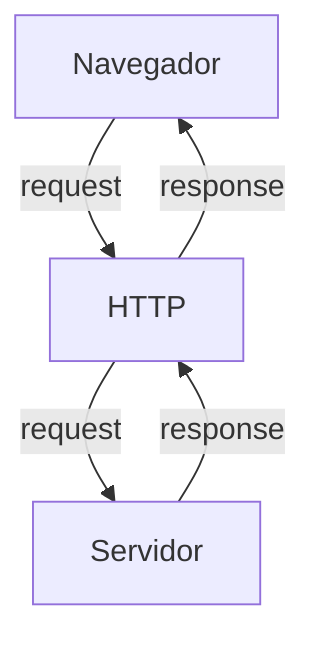
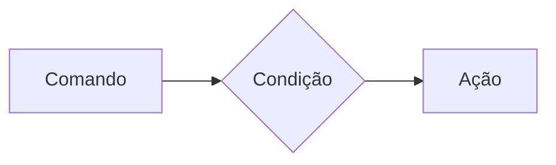
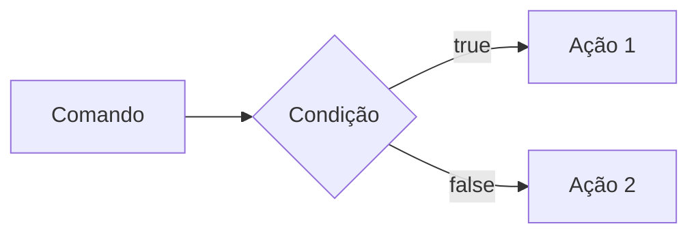
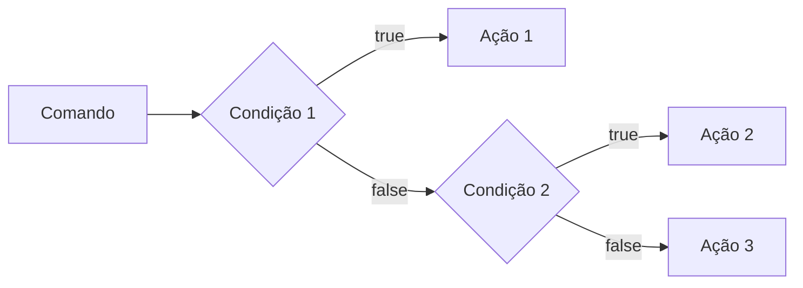
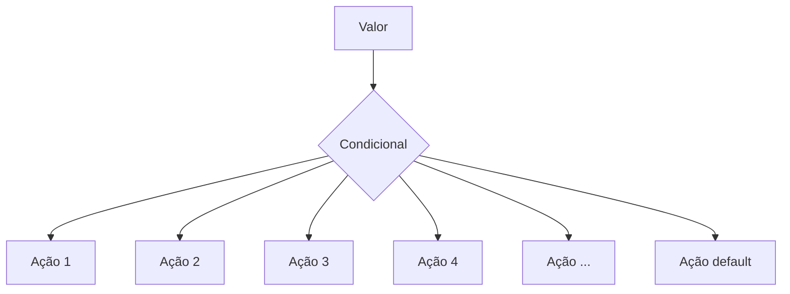
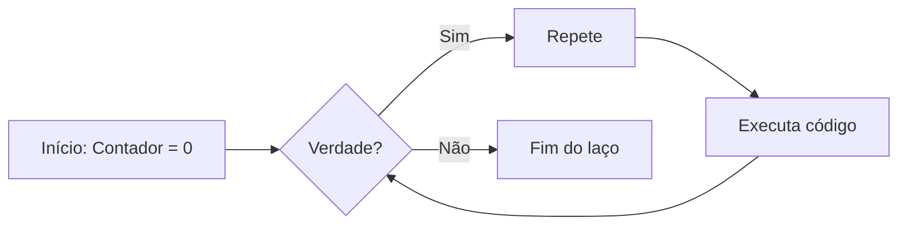
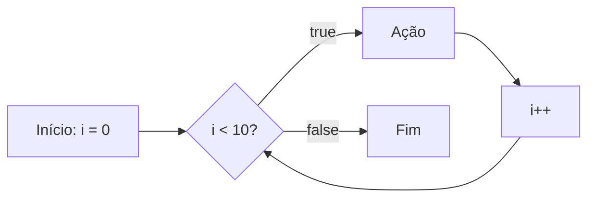

## Curso BackEnd - 225h - Técnico em Desenvolvimento de Sistemas - SENAI

Profº Diogo TB

Escola SENAI 

2º Semestre 2026

## Objetivos do Curso

- Desenvolver Aplicações web Server Side, utilizando a linguagem PHP;
- Aplicar Sintaxe Nativa PHP (Vanilla);
- Manipulação HTTP;
- Persistência de Dados;
- Segurança contra SQL Injection/CSRF;
- Refatoração em POO (Programação Orientada ao Objeto);
- Arquitetura MVC (Model, View, Controller);
- Utilização do Framework Laravel.

> ***OBS:*** Framework -> Conjunto de bibliotecas/ferramentas que oferecem uma solução completa para o desenvolvimento de alguma coisa.

## Cronograma do Semestre

**Carga Horária:** 105h (1º Semestre) e 120h (2º Semestre)

**Duração:** 20 Semanas (1º Semestre) e 20 Semanas (2º Semestre)

---
---

## SEMANA 1 - Introdução ao BackEnd e Configuração do Ambiente PHP

### O que é BackEnd?

O BackEnd é a parte de uma aplicação que o usuário não vê, mas que faz tudo funcionar por trás das telas.

Ele é a parte de um sistema que funciona nos servidores, sendo responsável por executar a lógica da aplicação, processar informações, aplicar as regras de negócio, gerenciar bancos de dados/armazenar dados e garantir o funcionamento correto do sistema.

Sempre que um usuário realiza uma ação, como fazer login ou efetuar uma compra, o backend recebe a solicitação, processa os dados e envia a resposta ao frontend. Além disso, também é responsável pela segurança, integração entre sistemas e armazenamento das informações, sendo essencial para o funcionamento de sites, aplicativos e diversos serviços digitais.

Além disso, o BackEnd é responsável por atender às solicitações do FrontEnd.

Ele é formado pelo servidor, banco de dados, lógica de programação com APIs e linguagens de programação/frameworks. Esses componentes trabalham juntos para processar dados, armazenar informações e garantir o funcionamento da aplicação.

#### Para que serve

- **Processar lógica de negócio:** regras, cálculos, validações (ex: calcular frete, aplicar desconto, validar login)

- **Gerenciar banco de dados:** salvar, buscar, atualizar e deletar informações

- **Autenticação e autorização:** controlar quem pode acessar o quê (login, senhas, permissões)

- **Fornecer APIs:** criar "pontes" (endpoints) para o frontend ou outros sistemas consumirem dados

- **Integração com serviços externos:** pagamentos, e-mails, notificações, APIs de terceiros

- **Segurança:** proteger dados sensíveis, evitar ataques (SQL injection, XSS, etc.)

- **Escalabilidade e performance:** garantir que o sistema aguente muitos usuários ao mesmo tempo.

#### Principais Linguagens de Programação

Ferramentas usadas para escrever o código do servidor, como Python, Node.js (JavaScript), Java e PHP.APIs: Os "caminhos" que permitem que o que você vê no celular converse com o servidor.

**Áreas de Atuação**
- Fintechs e Bancos
- Segurança, transações, alta escala 
- E-commerce
- Catálogo, pedidos, pagamentos
- Healthtechs
- Prontuários, telemedicina
- SaaS / Startups
- Logística
- Rastreio, rotas, tempo real
- Educação
- Plataformas, conteúdo, usuários
---

### O que é HTTP?

*HTTP*, Hypertext Transfer Protocol, é um protocolo de comunicação utilizado para transferência de informações na WWW (World Wide Web) e em outros sistemas de redes.

O HTTP é a base para que o cliente e um servidor web troquem informações. Ele permite a requisição e a resposta de recursos como imagens, arquivos e textos.



#### Como funciona o BackEnd na prática

- **Ação do Usuário:** Envia uma solicitação pela UI (Interface do Usuário).
**Exemplo de UI:** Tela do Celular, Navegador da Internet, Alexa, IOT...
- **Enviar uma Requisição/Request:** A UI transforma a ação do usuário em uma Requisição HTTP.
- **O Processamento BackEnd:** O código BackEnd recebe o pedido, valida os dados e decide o que fazer.
**Exemplo:** Consultar uma informação no Banco de Dados.
- **Resposta/Response:** O servidor devolde o resultado para a UI.
**Exemplo:** Um login autorizado, confirmação de uma compra...

#### Tipos de Requisição HTTP

Os tipos de requisição HTTP indicam a ação que o usuário deseja executar no servidor. As principais ações são:

- **GET:** Pede dados de um lugar específico do servidor. Não faz alterações no servidor.
- **DELETE:** Apaga um dado do servidor.
- **POST:** Envia dados novos para *criar* algo ou processar informações no servidor.
- **PUT/PATCH:** Modifica um dado já existente.
>**PUT:** Modificação completa de um objeto/item.

>**PATCH:** Modificação parcial de um objeto/item.
---
### Iniciando o PHP

**PHP** (HyperText PreProcessor) é uma linguagem de programação interpretada e open source, focada no desenvolvimento de sistemas para web. Pode ser usada junto com HTML para criação de páginas web dinâmicas.

O **PHP** de fato é uma das linguagens de programação mais populares da atualidade. Ela permite que você crie aplicações web robustas, de uma maneira muito simplificada e direta. A linguagem tem diversos recursos que facilitam e aceleram o processo de desenvolvimento de sites e sistemas para web. E além do mais, ela tem um ótimo ecossistema, uma excelente comunidade e um grande mercado de trabalho.

#### Instalando o PHP

- Fazer o download do PHP (php.net).

- ZIP -> NTS (Non Thread Safe), versão 8.5.9

- Descompactar o arquivo do PHP na pasta *C:\src\php* (para descompactar, usar o *7-Zip* = melhor).

- ***Nunca salvar arquivos ou programas na raiz do sistema (C:)***!!!

- Adicionar a pasta do PHP (*C:\src\php*) nas Variáveis de Ambiente do sistema (*PATH*).

>Verificar a instalação rodando o comando: `php --version`.

#### Criando Minha Primeira Aplicação em PHP

1. Antes de começar a codar:

- Preparar meu VSCODE;
- Criar um Profile próprio para PHP;
- Instalar extensões necessárias para transformar o VSCode em uma IDE:
    - **PHP Intelephense** -> Permite a utilização de Snippets (atalho de código)
    - **PHP Debug** -> Ajuda a encontrar erros de código
    - **PHP Cs Fixer** -> Formatação de códigos (Identação)
    - **PHP Server** -> Ajuda na criação de um servidor local para PHP
- Desabilitar o PHP Nativo do VSCode (@builtin PHP).

---
> Esse comando inicializa a aplicação PHP:
> `php -S localhost:8080`

---
2. Hello World ***(muito importante)*** ;)

---
---
## SEMANA 2 - Variáveis, Constantes e Operadores em PHP

#### Estudo de Variáveis e Constantes em PHP

Declarar variávies é alocar um espaço na memória que permite a inclusão e manipulação de dados. 

**Variávies:**

- devem ser declaradas usando "$" antes do nome da variável
- são não tipadas (não precisa declarar o tipo dela na criação)
- podem ser String, Numéricas (int/interger e float), Booleanas e Nulas; não permite declaração de Undefined
> Usar o `declare(strict_types=1);` na primeira linha do arquivo -> blinda o sistema contra conflitos de tipos de variáveis

**Constantes:**

- não podem ser mudadas ou recicladas após a criação
- podem ser criadas usando `const`ou `define`
- não permite ***interpolação*** (utilização de variáveis dentro de um texto, utilizando aspas duplas)

---
### Estudo de Operadores

**Aritméticos:** São usados para realizar cálculos.
|Operador|Nome|Exemplo|Resultado|
|--------|----|-------|---------|
|+|Adição|10+5|15|
|-|Subtração|10-5|5|
|*|Multiplicação|10*5|50
|/|Divisão|10/5|2|
|%|Módulo (resto)|10%3|1 (10/3 = 3, ou seja, sobra 1)|
|**|Expoente|2**3|8|

> ***OBS:*** O Operador % permite ordenar listas e organizar filas e pilhas.

---

**Relacionais:** Permite o relacionamento entre dois ou mais valores, o resultado de uma operação é sempre uma booleana (verdadeiro ou falso).

|Operador|Significado|Exemplo|Resultado|
|--------|-----------|-------|---------|
|>|Maior que|18 > 18|False|
|>=| Maior ou igual a|18 >= 18|True|
|<|Menor que|10 < 20|True|
|<=|Menor ou igual a|10 <= 5|False|
|==|Comparação de valor|"10"==10|True|
|===|Comparação estrita|"10"===10|False|
|!=|Diferente|"10"!=10|False|
|!==|Estritamente diferente|"10"!==10|True|

---

**Lógicos:** Permite a combinação entre sentenças.

- **Operador AND (E) -> && :** Para o resultado ser verdadeiro, todas as combinações precisam ser verdadeiras.
    - true && true -> true
    - true && false -> false

- **Operador OR (OU) -> || :** para o resultado ser verdadeiro, basta apenas uma condição ser verdadeira.
    - false || true -> true
    - false || false -> false

- **Operador NOT (NÃO) -> ! :** Inverte a lógica da operação
    - !true -> false
    - !false -> true

---
---
## SEMANA 3 - Estrutura de Controle de Dados (Condicionais e Repetição)

- **Conteúdo:** Estrutura `if`, `else` e `elseif`; Operadores ternários; `match` -> substituto do `switch/case`; Loops `for`, `while`, `do-while` e `foreach`.

### Estrutura de Controle de Dados ajudam no Processo de Automatização em Programas e Sistemas

#### ***Condicionais (IF, ELSE, ELSEIF)***

**Formas de Uso:**

- Uso do `if` apenas

**Exemplo:** Aplicar desconto de 10% em compras acima de 100 reais.



>PHP:
```php
if($valorCompra > 100){
    $valorFinal = $valorCompra * 0.9;
}
```
---

- Uso do `if` e do `else`

**Exemplo:** Aplicar um desconto de 10% para compras acima de 100 reais e 5% para as demais compras.



>PHP:
```php
if($valorCompra > 100){
    $valorFinal = $valorCompra * 0.9;
} else{
    $valorFinal = $valorCompra * 0.95;
}
```
---

- Uso do `elseif` (`if` encadeado) -> Estrutura usada para manipulação de dados em duas ou mais condicionais.

**Exemplo:** Compras acima de 200 reais tem 15% de desconto, compras acima de 100 reais tem 10% de desconto e demais compras tem 5% de desconto.



>PHP:
```php
if($valorCompra > 200){
    $valorFinal = $valorCompra * 0.85;
} elseif ($valorCompra > 100){
    $valorFinal = $valorCompra * 0.9;
} else {
    $valorFinal = $valorCompra * 0.95;
}
```
> ***OBS:*** **Sempre** usar `elseif` para situações que precisam de mais de uma condição, ou seja, fazer encadeamento das condições.

---

- Uso ***ERRADO*** do `if`:

>PHP:
```php
if ($valorCompra > 200){
    $valorFinal = $valorCompra * 0.85;
}
if ($valorCompra > 100){
    $valorFinal = $valorCompra * 0.9;
} else {
    $valorFinal = $valorCompra * 0.95;
}
```
---
### Operadores Ternários

Atalho para a estrutura condicional `if/else`, normalmente escrito em uma única linha de código.

> `condição ? verdadeiro : falso;`

-Perfeito para decisões curtas de uma linha de comando.

**Exemplo:** Verificar se a pessoa é maior de idade (18).

>PHP:
```php
$idade = 20;
// O formato é (condição ? verdadeiro : falso;)

$status = ($idade >= 18) ? "Maior de idade" : "Menor de idade";

$status2 = ($idade > 60) ? "Idoso" : ($idade >= 18) ? "Adulto" : "Criança";

echo $status;
```
---
### Expressão Condicional `match` (PHP 8)

No mercado atual de PHP, não se usa mais uma `Switch/Case` para chegar em valores fixos, usa-se o `match`. Ele compara um valor e retorna diretamente o resultado caso atenda a condição.


---
**Exemplo:** Selecionar o dia da semana a partir de um número.

>PHP:
```php
$diaSemanaNumerico = date("W"); // Pega o dia da semana em formato numérico

$nomeDiaSemana = match($diaSemanaNumerico){
    "0" -> "Domingo",
    "1" -> "Segunda",
    "2" -> "Terça",
    "3" -> "Quarta",
    "4" -> "Quinta",
    "5" -> "Sexta",
    "6" -> "Sábado",
    "default" -> "Dia inválido"
};

echo "Hoje é: $nomeDiaSemana";
```
---
### Laços de Repetição

Um laço de repetição faz com que um bloco de código rode várias vezes até que uma condição mande parar.

- **Laço `while` (enquanto):** Verifica se a condição é verdadeira ANTES de entrar no laço. Ideal quando não se sabe exatamente quantas vezes o laço vai rodar.


---
> -> **Exemplo de Aplicação do `while`:** Jogo de adivinhação de um número secreto.
```php
$numeroSecreto = rand(1,10);
$tentativas = 0;
$numeroEscolhido = 0;

while(numeroEscolhido != numeroSecreto){
    echo "Tente novamente!"
    // Escolher outro número para adivinhar
    numeroEscolhido = rand(1,10);
    tentativas++;
}

echo "Acertou! O número secreto é $numeroEscolhido."
```
---
- **Laço `do-while` (faça-enquanto):** A diferença entre ambos, é que o `do-while` executa o bloco pelo menos uma vez, mesmo que a condição seja falsa desde o início, pois ele só pergunta no final.


---
> -> **Exemplo de Aplicação do `do-while`:** Jogo de adivinhação de um número secreto.
```php
$numeroSecreto = rand(1,10);

 do{
    $numeroEscolhido = rand(1,10);

    if(numeroEscolhido == numeroSecreto){
        echo "Parabéns, acertou!!";
        break;
    }

    echo "Tente novamente!";

 } while(numeroEscolhido != numeroSecreto);
```
---
### Freio de Emergência: `break` e `continue`

Às vezes precisamos interferir no laço enquanto ele está rodando.

- `break` -> **Para tudo!** (Quebra o laço inteiro e vai embora).
- `continue` -> **Pula a rodada!** (Ignora o código daquela rodada específica e pula logo para a próxima repetição).

> -> **Exemplo de Aplicação do Código:** Sistema de Controle do Elevador.
```php
for($andar = 1 ; $andar<=10; $andar++){
    if($andar ==4){
        echo "Andar $andar está em obras. Passando direto!";
        continue;
    }

    echo "Elevador parou no andar $andar"
}
```
---
### Laço de Repetição `for`

Use o `for` quando você sabe quantas vezes precisa repetir uma ação ou quando precisa controlar um contador. Ele possui três partes:

- Inicialização
- Condição
- Incremento

> ***for (inicialização; condição; incremento) {
    ação
}***


---
> -> **Exemplo de Aplicação:** Exibir todos os meses do ano.
```php
for ($mes = 1; $mes <= 12; $mes++){
    echo "Mês $mes";
}
```
Nesse exemplo, `$mes` começa em 1, o laço continua enquanto `$mes` for menor ou igual a 12 e, ao final de cada aplicação, `$mes++` aumenta o contador em 1.

---
### Laço de Repetição `foreach`

Use o `foreach` quando precisar percorrer cada item de um **array**. Ele acessa os elementos diretamente, sem que você precise controlar o contador.

> -> **Exemplo de Aplicação:** Imprimir todos os itens de um vetor.
```php
$frutas = ["Maçã", "Banana", "Uva", "Pera"];

foreach ($frutas as $fruta){
    echo "Fruta: $fruta";
}
```
> -> **Outro exemplo:** Acessar a chave e o valor de cada item.
```php
$precos = [
    "Caderno" => 25.90,
    "Caneta" => 5.50,
    "Mochila" => 99.00
]; // vetor não ordenado chave => valor

foreach ($precos as $produto => $preco){
    echo "$produto: R$ number_format($preco,2)";
}
```
---
---
## SEMANA 4 - Modularização com Funções
### O Princípio do DRY (`Don't Repeat Yourself`)

Se uma lógica foi escrita duas vezes ou mais dentro de um código, essa lógica deve virar uma função.

---
### Funções Nativas do PHP

O PHP tem milhares de funções prontas, essas funções são chamadas de ***nativas***.

> **O que é uma função?**

Uma função é como uma máquina: você coloca uma matéria-prima ***(parâmetro)***, ela processa e devolve um produto final ***(retorno)***.

> -> **Exemplo de Função Nativa:**
```php
$texto = "senai americana";

// str_replace
$textoNovo = str_replace("americana","são paulo",$texto);

// strtoupper
echo strtoupper($textoNovo); // SENAI SÃO PAULO
```
---
### Principais Funções Nativas (mais utilizadas)

As funções abaixo já fazem parte do PHP e podem ser chamadas diretamente no código. Observe os parâmetros que cada uma recebe e o tipo de informação que ela retorna.

| Função | Categoria | O que faz | Como usar |
|---|---|---|---|
| `strlen()` | Strings | Retorna a quantidade de caracteres de um texto. | `$tamanho = strlen($texto);` |
| `strtoupper()` | Strings | Converte o texto para letras maiúsculas. | `$resultado = strtoupper($texto);` |
| `strtolower()` | Strings | Converte o texto para letras minúsculas. | `$resultado = strtolower($texto);` |
| `ucfirst()` | Strings | Converte a primeira letra do texto para maiúscula. | `$resultado = ucfirst($texto);` |
| `trim()` | Strings | Remove espaços e quebras de linha no início e no fim do texto. | `$limpo = trim($texto);` |
| `str_replace()` | Strings | Substitui uma parte do texto por outra. | `$novo = str_replace("-", "", $cpf);` |
| `substr()` | Strings | Extrai uma parte do texto a partir de uma posição. | `$inicio = substr($texto, 0, 3);` |
| `explode()` | Strings | Divide um texto e cria um array usando um separador. | `$palavras = explode(" ", $nome);` |
| `implode()` | Arrays | Junta os itens de um array em um único texto. | `$lista = implode(", ", $nomes);` |
| `count()` | Arrays | Conta a quantidade de itens de um array. | `$total = count($produtos);` |
| `in_array()` | Arrays | Verifica se um valor existe dentro de um array. | `$existe = in_array("SP", $estados, true);` |
| `array_push()` | Arrays | Adiciona um ou mais itens ao final de um array. | `array_push($nomes, "Ana");` |
| `array_pop()` | Arrays | Remove e retorna o último item de um array. | `$ultimo = array_pop($nomes);` |
| `sort()` | Arrays | Ordena um array em ordem crescente e reorganiza suas chaves. | `sort($notas);` |
| `array_keys()` | Arrays | Retorna um array contendo as chaves de outro array. | `$chaves = array_keys($produtos);` |
| `number_format()` | Números | Formata um número com casas decimais e separadores definidos. | `$preco = number_format($valor, 2, ',', '.');` |
| `round()` | Números | Arredonda um número para a quantidade de casas informada. | `$media = round($nota, 2);` |
| `max()` | Números | Retorna o maior valor de uma lista ou array. | `$maior = max($notas);` |
| `min()` | Números | Retorna o menor valor de uma lista ou array. | `$menor = min($notas);` |
| `is_numeric()` | Validação | Verifica se o valor é um número ou uma string numérica. | `if (is_numeric($entrada)) { ... }` |
| `isset()` | Validação | Verifica se uma variável existe e não possui valor `null`. | `if (isset($usuario)) { ... }` |
| `empty()` | Validação | Verifica se uma variável está vazia. | `if (empty($pedido)) { ... }` |
| `date()` | Data e hora | Formata uma data ou hora conforme uma máscara. | `$hoje = date('d/m/Y');` |
| `file_exists()` | Arquivos | Verifica se um arquivo ou diretório existe. | `if (file_exists('dados.txt')) { ... }` |
| `file_get_contents()` | Arquivos | Lê todo o conteúdo de um arquivo ou endereço. | `$conteudo = file_get_contents('dados.txt');` |
| `file_put_contents()` | Arquivos | Grava conteúdo em um arquivo, criando-o se necessário. | `file_put_contents('log.txt', $mensagem);` |

- **Atenção:** algumas funções modificam o array original, como `sort()`, `array_push()` e `array_pop()`. Já outras retornam um novo valor, como `count()`, `explode()` e `str_replace()`. Em caso de dúvida, consulte a documentação oficial do PHP e verifique o retorno da função.
---
#### Documentação PHP
> **Documentação PHP**:
[Acesse a documentação oficial do PHP em português](https://www.php.net/manual/pt_BR/)

> Consulte também: [Referência de funções do PHP](https://www.php.net/manual/pt_BR/funcref.php), para pesquisar a sintaxe, os parâmetros e os valores por cada função.
---
### Funções Customizadas (criando suas próprias máquinas)

Quando o PHP não tem a função desejada, nós a criamos!

***Regra de Ouro:*** Uma função deve focar em `return` (retornar um valor), e não em imprimir (`echo`).

> -> **Veja a diferença nesse exemplo:**
```php
function calcularTotal($preco, $quantidade){
    // a função calcula e retorna o resultado, mas não imprime nada
    return $preco * $quantidade;
}

$total = calcularTotal(25.00, 3);
echo "Total da compra: R$ " . number_format ($total, 2,",",".");
// Total da compra: R$ 75,00
```
> A função `calcularTotal()` pode ser utilizada em uma página, relatório ou teste. O `echo` aparece somente fora da função, no momento de apresentar o resultado ao usuário.
---
### Padrão de Uso Corporativo (PHP 8 Strict Types)

No mercado de trabalho, exigimos que a função avise exatamente o ***TIPO*** de dado que ela espera receber e o ***TIPO*** que ela vai devolver.

Isso é chamado de ***tipagem de funções***. Ao declarar os tipos, o código fica mais fácil de entender e o PHP consegue identificar alguns erros antes que eles causem problemas maiores no sistema.

Os tipos mais usados são:
- `int`: número inteiro (ex: 10, 1024...);
- `float`: número decimal ou ponto flutuante (ex: 10.50);
- `string`: texto (ex: "Texto");
- `bool`: valor lógico (true/false);
- `void`: identifica que a função não devolve nenhum valor.

> O **tipo** deve ser escrito antes do nome de cada ***parâmetro*** e o **tipo da função** deve ser escrito após os ***parênteses***, precedido por `:`, informando o que a função vai devolver.

**-> Exemplo de uso de função e parâmetros tipados:**
```php
function apresentarProduto(string $nome, float $preco): string{
    return "$nome custa R$ $preco";
}

$mensagem = apresentarProduto("Caderno", 25.90);
echo $mensagem;
// Caderno custa R$ 25.90
```
> ***Resumo:*** os **tipos dos parâmetros** documentam as entradas da função, o **tipo** após `:` documenta a saída da função.
---
### O Tipo Mágico: `void`

Se uma função faz um trabalho interno e **não retorna NADA**, dizemos que o retorno dela é vazio (`void`).

**-> Exemplo de função sem retorno:**
```php
function registroLog(string $mensagem): void{
    // apenas salvar em um arquivo de texto, não devolver nenhuma variável
    file_put_contents("erro.log", $mensagem);
}
```
---
### Escopo e Referência (o segredo da memória)

**- O que é Escopo? ***(A Regra de Las Vegas)*****

> *O que acontece dentro da função, fica dentro da função*. Uma variável criada fora não existe lá dentro, e uma criada lá dentro "morre" quando a função acaba.

**Escopo** é o local do programa onde a variável pode ser armazenada/acessada. Em PHP, uma variável criada fora de uma função pertence ao **escopo global**. Uma variável criada dentro de uma função pertence ao **escopo local**.

**-> Exemplo de Escopo de Variável:**

```php 
$nomeSistema = "CRM Senai"; // variável global

function criarMensagem():string{
    $mensagem = "Bem-Vindo(a)!"; // variável local
    return $mensagem;
}

echo $nomeSistema; // correto: está no escopo global.
echo criarMensagem(); // correto: a função devolve sua variável local.
echo $mensagem; // incorreto: $mensagem só existe dentro da função, não é acessada fora.
```
---
**- Como enviar dados para uma função?**

A forma mais segura e organizada é enviar os dados por **parâmetros**. Assim, a função não precisa acessar diretamente variáveis globais:
```php
function saudar(string $nome):string{
    return "Olá, $nome!";
}

$nomeCliente = "Mayne";
echo saudar($nomeCliente); // Olá, Mayne!
```
- Nesse caso, `$nomeCliente` continua no ***escopo global***, mas seu valor é enviado para o parâmetro local `$nome`. A função recebe uma informação, processa e retorna o resultado.

**-> Exemplo Incorreto:**
```php
$nome = "Mayne";
function saudar():string{
    return "Olá, $nome!";
}
```
- A função `saudar` não conhece a variável global `$nome`.
---
> ***Resumo:*** ***variáveis*** protegem os dados internos da função; ***parâmetros*** são o caminho recomendado para evitar erros e enviar informações; `return` é usado para devolver um resultado ao código que chamou a função.