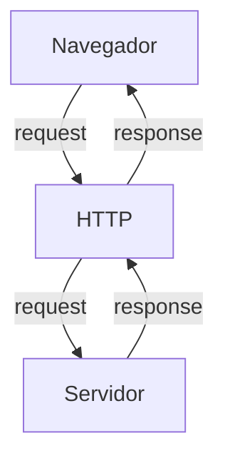

## Curso BackEnd - 225h - Técnico em Desenvolvimento de Sistemas - SENAI

Profº Diogo TB

Escola SENAI 

2º Semestre 2026

## Objetivos do Curso

- Desenvolver Aplicações web Server Side, utilizando a linguagem PHP;
- Aplicar Sintaxe Nativa PHP (Vanilla);
- Manipulação HTTP;
- Persistência de Dados;
- Segurança contra SQL Injection/CSRF;
- Refatoração em POO (Programação Orientada ao Objeto);
- Arquitetura MVC (Model, View, Controller);
- Utilização do Framework Laravel.

OBS: Framework -> Conjunto de bibliotecas/ferramentas que oferecem uma solução completa para o desenvolvimento de alguma coisa.

## Cronograma do Semestre

Carga Horária: 105h (1º Semestre) e 120h (2º Semestre)

Duração: 20 Semanas (1º Semestre) e 20 Semanas (2º Semestre)

### Semana 1: Introdução ao BackEnd e Configuração do Ambiente PHP

### O que é BackEnd?

O BackEnd é a parte de uma aplicação que o usuário não vê, mas que faz tudo funcionar por trás das telas.

Ele é a parte de um sistema que funciona nos servidores, sendo responsável por executar a lógica da aplicação, processar informações, aplicar as regras de negócio, gerenciar bancos de dados/armazenar dados e garantir o funcionamento correto do sistema.

Sempre que um usuário realiza uma ação, como fazer login ou efetuar uma compra, o backend recebe a solicitação, processa os dados e envia a resposta ao frontend. Além disso, também é responsável pela segurança, integração entre sistemas e armazenamento das informações, sendo essencial para o funcionamento de sites, aplicativos e diversos serviços digitais.

Além disso, o BackEnd é responsável por atender às solicitações do FrontEnd.

Ele é formado pelo servidor, banco de dados, lógica de programação com APIs e linguagens de programação/frameworks. Esses componentes trabalham juntos para processar dados, armazenar informações e garantir o funcionamento da aplicação.

#### Para que serve

- Processar lógica de negócio: regras, cálculos, validações (ex: calcular frete, aplicar desconto, validar login)

- Gerenciar banco de dados: salvar, buscar, atualizar e deletar informações

- Autenticação e autorização: controlar quem pode acessar o quê (login, senhas, permissões)

- Fornecer APIs: criar "pontes" (endpoints) para o frontend ou outros sistemas consumirem dados

- Integração com serviços externos: pagamentos, e-mails, notificações, APIs de terceiros

- Segurança: proteger dados sensíveis, evitar ataques (SQL injection, XSS, etc.)

- Escalabilidade e performance: garantir que o sistema aguente muitos usuários ao mesmo tempo.

#### Principais Linguagens de Programação

Ferramentas usadas para escrever o código do servidor, como Python, Node.js (JavaScript), Java e PHP.APIs: Os "caminhos" que permitem que o que você vê no celular converse com o servidor.

**Áreas de Atuação**
- Fintechs e Bancos
- Segurança, transações, alta escala 
- E-commerce
- Catálogo, pedidos, pagamentos
- Healthtechs
- Prontuários, telemedicina
- SaaS / Startups
- Logística
- Rastreio, rotas, tempo real
- Educação
- Plataformas, conteúdo, usuários
---

### O que é HTTP?

*HTTP*, Hypertext Transfer Protocol, é um protocolo de comunicação utilizado para transferência de informações na WWW (World Wide Web) e em outros sistemas de redes.

O HTTP é a base para que o cliente e um servidor web troquem informações. Ele permite a requisição e a resposta de recursos como imagens, arquivos e textos.

#### Como funciona o BackEnd na prática

- **Ação do Usuário:** Envia uma solicitação pela UI (Interface do Usuário).
**Exemplo de UI:** Tela do Celular, Navegador da Internet, Alexa, IOT...
- **Enviar uma Requisição/Request**: A UI transforma a ação do usuário em uma Requisição HTTP.
- **O Processamento BackEnd:** O código BackEnd recebe o pedido, valida os dados e decide o que fazer.
**Exemplo:** Consultar uma informação no Banco de Dados.
- **Resposta/Response:** O servidor devolde o resultado para a UI.
**Exemplo:** Um login autorizado, confirmação de uma compra...

#### Tipos de Requisição HTTP

Os tipos de requisição HTTP indicam a ação que o usuário deseja executar no servidor. As principais ações são:

- **GET:** Pede dados de um lugar específico do servidor. Não faz alterações no servidor.
- **DELETE:** Apaga um dado do servidor.
- **POST:** Envia dados novos para *criar* algo ou processar informações no servidor.
- **PUT/PATCH:** Modifica um dado já existente.
>**PUT:** Modificação completa de um objeto/item.

>**PATCH:** Modificação parcial de um objeto/item.
---
### Iniciando o PHP

**PHP** (HyperText PreProcessor) é uma linguagem de programação interpretada e open source, focada no desenvolvimento de sistemas para web. Pode ser usada junto com HTML para criação de páginas web dinâmicas.

O **PHP** de fato é uma das linguagens de programação mais populares da atualidade. Ela permite que você crie aplicações web robustas, de uma maneira muito simplificada e direta. A linguagem tem diversos recursos que facilitam e aceleram o processo de desenvolvimento de sites e sistemas para web. E além do mais, ela tem um ótimo ecossistema, uma excelente comunidade e um grande mercado de trabalho.

#### Instalando o PHP

- Fazer o download do PHP (php.net).

- ZIP -> NTS (Non Thread Safe), versão 8.5.9

- Descompactar o arquivo do PHP na pasta *C:\src\php* (para descompactar, usar o *7-Zip* = melhor).

- ***Nunca salvar arquivos ou programas na raiz do sistema (C:)***!!!

- Adicionar a pasta do PHP (*C:\src\php*) nas Variáveis de Ambiente do sistema (*PATH*).

>Verificar a instalação rodando o comando: `php --version`.

#### Criando Minha Primeira Aplicação em PHP

1. Antes de começar a codar:

- Preparar meu VSCODE;
- Criar um Profile próprio para PHP;
- Instalar extensões necessárias para transformar o VSCode em uma IDE:
    - **PHP Intelephense** -> Permite a utilização de Snippets (atalho de código)
    - **PHP Debug** -> Ajuda a encontrar erros de código
    - **PHP Cs Fixer** -> Formatação de códigos (Identação)
    - **PHP Server** -> Ajuda na criação de um servidor local para PHP
- Desabilitar o PHP Nativo do VSCode (@builtin PHP).

---
>Esse comando inicializa a aplicação PHP:
>`php -S localhost:8080`

---
2. Hello World ***(muito importante)***

#### Estudo de Variáveis e Constantes em PHP

Declarar variávies é alocar um espaço na memória que permite a inclusão e manipulação de dados. 

**Variávies:**

- devem ser declaradas usando "$" antes do nome da variável
- são não tipadas (não precisa declarar o tipo dela na criação)
- podem ser String, Numéricas (int/interger e float), Booleanas e Nulas; não permite declaração de Undefined
> Usar o `declare(strict_types=1);` na primeira linha do arquivo -> blinda o sistema contra conflitos de tipos de variáveis

**Constantes:**

- não podem ser mudadas ou recicladas após a criação
- podem ser criadas usando `const`ou `define`
- não permite ***interpolação*** (utilização de variáveis dentro de um texto, utilizando aspas duplas)

---
#### Estudo de Operadores

**Aritméticos:** São usados para realizar cálculos.
|Operador|Nome|Exemplo|Resultado|
|--------|----|-------|---------|
|+|Adição|10+5|15|
|-|Subtração|10-5|5|
|*|Multiplicação|10*5|50
|/|Divisão|10/5|2|
|%|Módulo (resto)|10%3|1 (10/3 = 3, ou seja, sobra 1)|
|**|Expoente|2**3|8|

**OBS:** O Operador % permite ordenar listas e organizar filas e pilhas.

---
**Relacionais:** Permite o relacionamento entre dois ou mais valores, o resultado de uma operação é sempre uma booleana (verdadeiro ou falso).

|Operador|Significado|Exemplo|Resultado|
|--------|-----------|-------|---------|
|>|Maior que|18 > 18|False|
|>=| Maior ou igual a|18 >= 18|True|
|<|Menor que|10 < 20|True|
|<=|Menor ou igual a|10 <= 5|False|
|==|Comparação de valor|"10"==10|True|

---
**Lógicos:** 