## Curso BackEnd - 225h - Técnico em Desenvolvimento de Sistemas - SENAI

Profº Diogo TB

Escola SENAI 

2º Semestre 2026

## Objetivos do Curso

- Desenvolver Aplicações web Server Side, utilizando a linguagem PHP;
- Aplicar Sintaxe Nativa PHP (Vanilla);
- Manipulação HTTP;
- Persistência de Dados;
- Segurança contra SQL Injection/CSRF;
- Refatoração em POO (Programação Orientada ao Objeto);
- Arquitetura MVC (Model, View, Controller);
- Utilização do Framework Laravel.

> ***OBS:*** Framework -> Conjunto de bibliotecas/ferramentas que oferecem uma solução completa para o desenvolvimento de alguma coisa.

## Cronograma do Semestre

**Carga Horária:** 105h (1º Semestre) e 120h (2º Semestre)

**Duração:** 20 Semanas (1º Semestre) e 20 Semanas (2º Semestre)

---
---

## SEMANA 1 - Introdução ao BackEnd e Configuração do Ambiente PHP

### O que é BackEnd?

`É a resposta/requisição do usuário!!!`

- **Requisição:** É o pedido enviado por um cliente (como um navegador ou aplicativo) para um servidor com o objetivo de buscar, enviar, atualizar ou apagar dados.

#### **Tipos de Requisição HTTP**

Os tipos de requisição HTTP indicam a ação que o usuário deseja executar no servidor. As principais ações são:

- **GET:** Pede dados de um lugar específico do servidor. Não faz alterações no servidor.
- **DELETE:** Apaga um dado do servidor.
- **POST:** Envia dados novos para *criar* algo ou processar informações no servidor.
- **PUT/PATCH:** Modifica um dado já existente.
>**PUT:** Modificação completa de um objeto/item.

>**PATCH:** Modificação parcial de um objeto/item.
---

O BackEnd é a parte de uma aplicação que o usuário não vê, mas que faz tudo funcionar por trás das telas.

Ele é a parte de um sistema que funciona nos servidores, sendo responsável por executar a lógica da aplicação, processar informações, aplicar as regras de negócio, gerenciar bancos de dados/armazenar dados e garantir o funcionamento correto do sistema.

Sempre que um usuário realiza uma ação, como fazer login ou efetuar uma compra, o backend recebe a solicitação, processa os dados e envia a resposta ao frontend. Além disso, também é responsável pela segurança, integração entre sistemas e armazenamento das informações, sendo essencial para o funcionamento de sites, aplicativos e diversos serviços digitais.

Além disso, o BackEnd é responsável por atender às solicitações do FrontEnd.

Ele é formado pelo servidor, banco de dados, lógica de programação com APIs e linguagens de programação/frameworks. Esses componentes trabalham juntos para processar dados, armazenar informações e garantir o funcionamento da aplicação.

#### Para que serve

- **Processar lógica de negócio:** regras, cálculos, validações (ex: calcular frete, aplicar desconto, validar login)

- **Gerenciar banco de dados:** salvar, buscar, atualizar e deletar informações

- **Autenticação e autorização:** controlar quem pode acessar o quê (login, senhas, permissões)

- **Fornecer APIs:** criar "pontes" (endpoints) para o frontend ou outros sistemas consumirem dados

- **Integração com serviços externos:** pagamentos, e-mails, notificações, APIs de terceiros

- **Segurança:** proteger dados sensíveis, evitar ataques (SQL injection, XSS, etc.)

- **Escalabilidade e performance:** garantir que o sistema aguente muitos usuários ao mesmo tempo.

#### Principais Linguagens de Programação

Ferramentas usadas para escrever o código do servidor, como Python, Node.js (JavaScript), Java e PHP.APIs: Os "caminhos" que permitem que o que você vê no celular converse com o servidor.

**Áreas de Atuação**
- Fintechs e Bancos
- Segurança, transações, alta escala 
- E-commerce
- Catálogo, pedidos, pagamentos
- Healthtechs
- Prontuários, telemedicina
- SaaS / Startups
- Logística
- Rastreio, rotas, tempo real
- Educação
- Plataformas, conteúdo, usuários
---

### O que é HTTP?

*HTTP*, Hypertext Transfer Protocol, é um protocolo de comunicação utilizado para transferência de informações na WWW (World Wide Web) e em outros sistemas de redes.

O HTTP é a base para que o cliente e um servidor web troquem informações. Ele permite a requisição e a resposta de recursos como imagens, arquivos e textos.

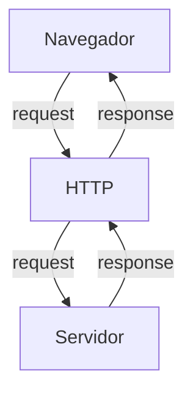

#### Como funciona o BackEnd na prática

- **Ação do Usuário:** Envia uma solicitação pela UI (Interface do Usuário).
**Exemplo de UI:** Tela do Celular, Navegador da Internet, Alexa, IOT...
- **Enviar uma Requisição/Request:** A UI transforma a ação do usuário em uma Requisição HTTP.
- **O Processamento BackEnd:** O código BackEnd recebe o pedido, valida os dados e decide o que fazer.
**Exemplo:** Consultar uma informação no Banco de Dados.
- **Resposta/Response:** O servidor devolde o resultado para a UI.
**Exemplo:** Um login autorizado, confirmação de uma compra...

---
### Iniciando o PHP

**PHP** (HyperText PreProcessor) é uma linguagem de programação interpretada e open source, focada no desenvolvimento de sistemas para web. Pode ser usada junto com HTML para criação de páginas web dinâmicas.

O **PHP** de fato é uma das linguagens de programação mais populares da atualidade. Ela permite que você crie aplicações web robustas, de uma maneira muito simplificada e direta. A linguagem tem diversos recursos que facilitam e aceleram o processo de desenvolvimento de sites e sistemas para web. E além do mais, ela tem um ótimo ecossistema, uma excelente comunidade e um grande mercado de trabalho.

#### Instalando o PHP

- Fazer o download do PHP (php.net).

- ZIP -> NTS (Non Thread Safe), versão 8.5.9

- Descompactar o arquivo do PHP na pasta *C:\src\php* (para descompactar, usar o *7-Zip* = melhor).

- ***Nunca salvar arquivos ou programas na raiz do sistema (C:)***!!!

- Adicionar a pasta do PHP (*C:\src\php*) nas Variáveis de Ambiente do sistema (*PATH*).

>Verificar a instalação rodando o comando: `php --version`.

#### Criando Minha Primeira Aplicação em PHP

1. Antes de começar a codar:

- Preparar meu VSCODE;
- Criar um Profile próprio para PHP;
- Instalar extensões necessárias para transformar o VSCode em uma IDE:
    - **PHP Intelephense** -> Permite a utilização de Snippets (atalho de código)
    - **PHP Debug** -> Ajuda a encontrar erros de código
    - **PHP Cs Fixer** -> Formatação de códigos (Identação)
    - **PHP Server** -> Ajuda na criação de um servidor local para PHP
- Desabilitar o PHP Nativo do VSCode (@builtin PHP).

---
> Esse comando inicializa a aplicação PHP:
> `php -S localhost:8080`

---
2. Hello World ***(muito importante)*** ;)

---
---
## SEMANA 2 - Variáveis, Constantes e Operadores em PHP

#### Estudo de Variáveis e Constantes em PHP

Declarar variávies é alocar um espaço na memória que permite a inclusão e manipulação de dados. 

**Variávies:**

- devem ser declaradas usando "$" antes do nome da variável
- são não tipadas (não precisa declarar o tipo dela na criação)
- podem ser String, Numéricas (int/interger e float), Booleanas e Nulas; não permite declaração de Undefined
> Usar o `declare(strict_types=1);` na primeira linha do arquivo -> blinda o sistema contra conflitos de tipos de variáveis

**Constantes:**

- não podem ser mudadas ou recicladas após a criação
- podem ser criadas usando `const`ou `define`
- não permite ***interpolação*** (utilização de variáveis dentro de um texto, utilizando aspas duplas)

---
### Estudo de Operadores

**Aritméticos:** São usados para realizar cálculos.
|Operador|Nome|Exemplo|Resultado|
|--------|----|-------|---------|
|+|Adição|10+5|15|
|-|Subtração|10-5|5|
|*|Multiplicação|10*5|50
|/|Divisão|10/5|2|
|%|Módulo (resto)|10%3|1 (10/3 = 3, ou seja, sobra 1)|
|**|Expoente|2**3|8|

> ***OBS:*** O Operador % permite ordenar listas e organizar filas e pilhas.

---

**Relacionais:** Permite o relacionamento entre dois ou mais valores, o resultado de uma operação é sempre uma booleana (verdadeiro ou falso).

|Operador|Significado|Exemplo|Resultado|
|--------|-----------|-------|---------|
|>|Maior que|18 > 18|False|
|>=| Maior ou igual a|18 >= 18|True|
|<|Menor que|10 < 20|True|
|<=|Menor ou igual a|10 <= 5|False|
|==|Comparação de valor|"10"==10|True|
|===|Comparação estrita|"10"===10|False|
|!=|Diferente|"10"!=10|False|
|!==|Estritamente diferente|"10"!==10|True|

---

**Lógicos:** Permite a combinação entre sentenças.

- **Operador AND (E) -> && :** Para o resultado ser verdadeiro, todas as combinações precisam ser verdadeiras.
    - true && true -> true
    - true && false -> false

- **Operador OR (OU) -> || :** para o resultado ser verdadeiro, basta apenas uma condição ser verdadeira.
    - false || true -> true
    - false || false -> false

- **Operador NOT (NÃO) -> ! :** Inverte a lógica da operação
    - !true -> false
    - !false -> true

---
---
## SEMANA 3 - Estrutura de Controle de Dados (Condicionais e Repetição)

- **Conteúdo:** Estrutura `if`, `else` e `elseif`; Operadores ternários; `match` -> substituto do `switch/case`; Loops `for`, `while`, `do-while` e `foreach`.

### Estrutura de Controle de Dados ajudam no Processo de Automatização em Programas e Sistemas

#### ***Condicionais (IF, ELSE, ELSEIF)***

**Formas de Uso:**

- Uso do `if` apenas

**Exemplo:** Aplicar desconto de 10% em compras acima de 100 reais.

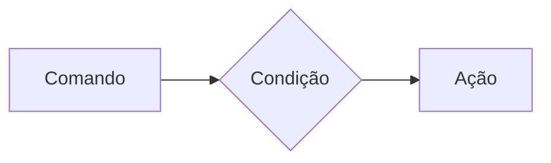

>PHP:
```php
if($valorCompra > 100){
    $valorFinal = $valorCompra * 0.9;
}
```
---

- Uso do `if` e do `else`

**Exemplo:** Aplicar um desconto de 10% para compras acima de 100 reais e 5% para as demais compras.

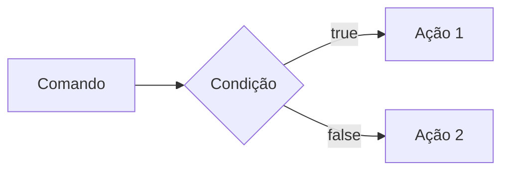

>PHP:
```php
if($valorCompra > 100){
    $valorFinal = $valorCompra * 0.9;
} else{
    $valorFinal = $valorCompra * 0.95;
}
```
---

- Uso do `elseif` (`if` encadeado) -> Estrutura usada para manipulação de dados em duas ou mais condicionais.

**Exemplo:** Compras acima de 200 reais tem 15% de desconto, compras acima de 100 reais tem 10% de desconto e demais compras tem 5% de desconto.

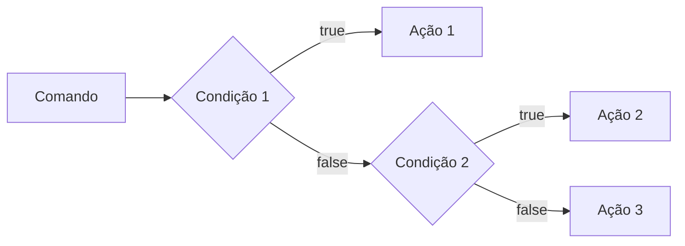

>PHP:
```php
if($valorCompra > 200){
    $valorFinal = $valorCompra * 0.85;
} elseif ($valorCompra > 100){
    $valorFinal = $valorCompra * 0.9;
} else {
    $valorFinal = $valorCompra * 0.95;
}
```
> ***OBS:*** **Sempre** usar `elseif` para situações que precisam de mais de uma condição, ou seja, fazer encadeamento das condições.

---

- Uso ***ERRADO*** do `if`:

>PHP:
```php
if ($valorCompra > 200){
    $valorFinal = $valorCompra * 0.85;
}
if ($valorCompra > 100){
    $valorFinal = $valorCompra * 0.9;
} else {
    $valorFinal = $valorCompra * 0.95;
}
```
---
### Operadores Ternários

Atalho para a estrutura condicional `if/else`, normalmente escrito em uma única linha de código.

> `condição ? verdadeiro : falso;`

-Perfeito para decisões curtas de uma linha de comando.

**Exemplo:** Verificar se a pessoa é maior de idade (18).

>PHP:
```php
$idade = 20;
// O formato é (condição ? verdadeiro : falso;)

$status = ($idade >= 18) ? "Maior de idade" : "Menor de idade";

$status2 = ($idade > 60) ? "Idoso" : ($idade >= 18) ? "Adulto" : "Criança";

echo $status;
```
---
### Expressão Condicional `match` (PHP 8)

No mercado atual de PHP, não se usa mais uma `Switch/Case` para chegar em valores fixos, usa-se o `match`. Ele compara um valor e retorna diretamente o resultado caso atenda a condição.

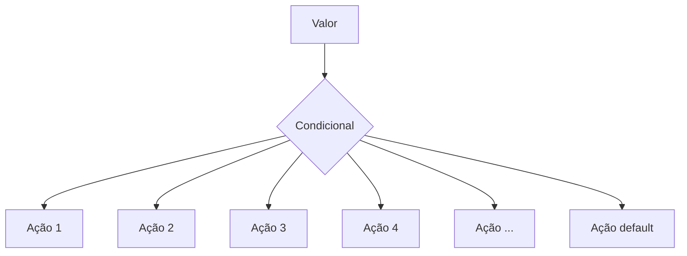
---
**Exemplo:** Selecionar o dia da semana a partir de um número.

>PHP:
```php
$diaSemanaNumerico = date("W"); // Pega o dia da semana em formato numérico

$nomeDiaSemana = match($diaSemanaNumerico){
    "0" -> "Domingo",
    "1" -> "Segunda",
    "2" -> "Terça",
    "3" -> "Quarta",
    "4" -> "Quinta",
    "5" -> "Sexta",
    "6" -> "Sábado",
    "default" -> "Dia inválido"
};

echo "Hoje é: $nomeDiaSemana";
```
---
### Laços de Repetição

Um laço de repetição faz com que um bloco de código rode várias vezes até que uma condição mande parar.

- **Laço `while` (enquanto):** Verifica se a condição é verdadeira ANTES de entrar no laço. Ideal quando não se sabe exatamente quantas vezes o laço vai rodar.

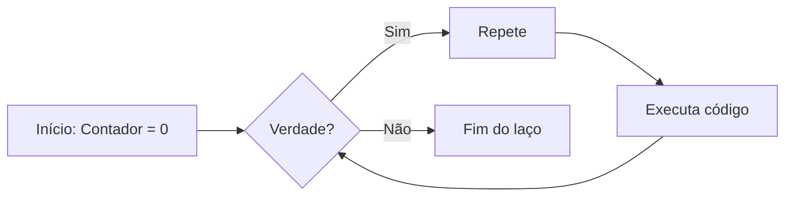
---
> -> **Exemplo de Aplicação do `while`:** Jogo de adivinhação de um número secreto.
```php
$numeroSecreto = rand(1,10);
$tentativas = 0;
$numeroEscolhido = 0;

while(numeroEscolhido != numeroSecreto){
    echo "Tente novamente!"
    // Escolher outro número para adivinhar
    numeroEscolhido = rand(1,10);
    tentativas++;
}

echo "Acertou! O número secreto é $numeroEscolhido."
```
---
- **Laço `do-while` (faça-enquanto):** A diferença entre ambos, é que o `do-while` executa o bloco pelo menos uma vez, mesmo que a condição seja falsa desde o início, pois ele só pergunta no final.

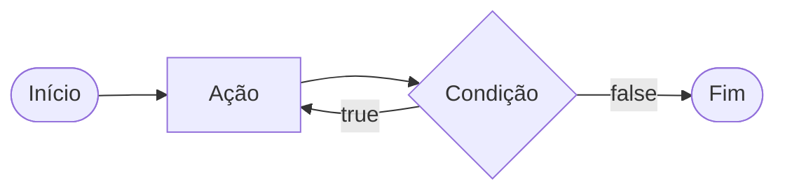
---
> -> **Exemplo de Aplicação do `do-while`:** Jogo de adivinhação de um número secreto.
```php
$numeroSecreto = rand(1,10);

 do{
    $numeroEscolhido = rand(1,10);

    if(numeroEscolhido == numeroSecreto){
        echo "Parabéns, acertou!!";
        break;
    }

    echo "Tente novamente!";

 } while(numeroEscolhido != numeroSecreto);
```
---
### Freio de Emergência: `break` e `continue`

Às vezes precisamos interferir no laço enquanto ele está rodando.

- `break` -> **Para tudo!** (Quebra o laço inteiro e vai embora).
- `continue` -> **Pula a rodada!** (Ignora o código daquela rodada específica e pula logo para a próxima repetição).

> -> **Exemplo de Aplicação do Código:** Sistema de Controle do Elevador.
```php
for($andar = 1 ; $andar<=10; $andar++){
    if($andar ==4){
        echo "Andar $andar está em obras. Passando direto!";
        continue;
    }

    echo "Elevador parou no andar $andar"
}
```
---
### Laço de Repetição `for`

Use o `for` quando você sabe quantas vezes precisa repetir uma ação ou quando precisa controlar um contador. Ele possui três partes:

- Inicialização
- Condição
- Incremento

> ***for (inicialização; condição; incremento) {
    ação
}***

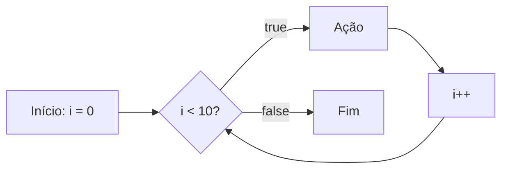
---
> -> **Exemplo de Aplicação:** Exibir todos os meses do ano.
```php
for ($mes = 1; $mes <= 12; $mes++){
    echo "Mês $mes";
}
```
Nesse exemplo, `$mes` começa em 1, o laço continua enquanto `$mes` for menor ou igual a 12 e, ao final de cada aplicação, `$mes++` aumenta o contador em 1.

---
### Laço de Repetição `foreach`

Use o `foreach` quando precisar percorrer cada item de um **array**. Ele acessa os elementos diretamente, sem que você precise controlar o contador.

> -> **Exemplo de Aplicação:** Imprimir todos os itens de um vetor.
```php
$frutas = ["Maçã", "Banana", "Uva", "Pera"];

foreach ($frutas as $fruta){
    echo "Fruta: $fruta";
}
```
> -> **Outro exemplo:** Acessar a chave e o valor de cada item.
```php
$precos = [
    "Caderno" => 25.90,
    "Caneta" => 5.50,
    "Mochila" => 99.00
]; // vetor não ordenado chave => valor

foreach ($precos as $produto => $preco){
    echo "$produto: R$ number_format($preco,2)";
}
```
---
---
## SEMANA 4 - Modularização com Funções
### O Princípio do DRY (`Don't Repeat Yourself`)

Se uma lógica foi escrita duas vezes ou mais dentro de um código, essa lógica deve virar uma função.

---
### Funções Nativas do PHP

O PHP tem milhares de funções prontas, essas funções são chamadas de ***nativas***.

> **O que é uma função?**

Uma função é como uma máquina: você coloca uma matéria-prima ***(parâmetro)***, ela processa e devolve um produto final ***(retorno)***.

> -> **Exemplo de Função Nativa:**
```php
$texto = "senai americana";

// str_replace
$textoNovo = str_replace("americana","são paulo",$texto);

// strtoupper
echo strtoupper($textoNovo); // SENAI SÃO PAULO
```
---
### Principais Funções Nativas (mais utilizadas)

As funções abaixo já fazem parte do PHP e podem ser chamadas diretamente no código. Observe os parâmetros que cada uma recebe e o tipo de informação que ela retorna.

| Função | Categoria | O que faz | Como usar |
|---|---|---|---|
| `strlen()` | Strings | Retorna a quantidade de caracteres de um texto. | `$tamanho = strlen($texto);` |
| `strtoupper()` | Strings | Converte o texto para letras maiúsculas. | `$resultado = strtoupper($texto);` |
| `strtolower()` | Strings | Converte o texto para letras minúsculas. | `$resultado = strtolower($texto);` |
| `ucfirst()` | Strings | Converte a primeira letra do texto para maiúscula. | `$resultado = ucfirst($texto);` |
| `trim()` | Strings | Remove espaços e quebras de linha no início e no fim do texto. | `$limpo = trim($texto);` |
| `str_replace()` | Strings | Substitui uma parte do texto por outra. | `$novo = str_replace("-", "", $cpf);` |
| `substr()` | Strings | Extrai uma parte do texto a partir de uma posição. | `$inicio = substr($texto, 0, 3);` |
| `explode()` | Strings | Divide um texto e cria um array usando um separador. | `$palavras = explode(" ", $nome);` |
| `implode()` | Arrays | Junta os itens de um array em um único texto. | `$lista = implode(", ", $nomes);` |
| `count()` | Arrays | Conta a quantidade de itens de um array. | `$total = count($produtos);` |
| `in_array()` | Arrays | Verifica se um valor existe dentro de um array. | `$existe = in_array("SP", $estados, true);` |
| `array_push()` | Arrays | Adiciona um ou mais itens ao final de um array. | `array_push($nomes, "Ana");` |
| `array_pop()` | Arrays | Remove e retorna o último item de um array. | `$ultimo = array_pop($nomes);` |
| `sort()` | Arrays | Ordena um array em ordem crescente e reorganiza suas chaves. | `sort($notas);` |
| `array_keys()` | Arrays | Retorna um array contendo as chaves de outro array. | `$chaves = array_keys($produtos);` |
| `number_format()` | Números | Formata um número com casas decimais e separadores definidos. | `$preco = number_format($valor, 2, ',', '.');` |
| `round()` | Números | Arredonda um número para a quantidade de casas informada. | `$media = round($nota, 2);` |
| `max()` | Números | Retorna o maior valor de uma lista ou array. | `$maior = max($notas);` |
| `min()` | Números | Retorna o menor valor de uma lista ou array. | `$menor = min($notas);` |
| `is_numeric()` | Validação | Verifica se o valor é um número ou uma string numérica. | `if (is_numeric($entrada)) { ... }` |
| `isset()` | Validação | Verifica se uma variável existe e não possui valor `null`. | `if (isset($usuario)) { ... }` |
| `empty()` | Validação | Verifica se uma variável está vazia. | `if (empty($pedido)) { ... }` |
| `date()` | Data e hora | Formata uma data ou hora conforme uma máscara. | `$hoje = date('d/m/Y');` |
| `file_exists()` | Arquivos | Verifica se um arquivo ou diretório existe. | `if (file_exists('dados.txt')) { ... }` |
| `file_get_contents()` | Arquivos | Lê todo o conteúdo de um arquivo ou endereço. | `$conteudo = file_get_contents('dados.txt');` |
| `file_put_contents()` | Arquivos | Grava conteúdo em um arquivo, criando-o se necessário. | `file_put_contents('log.txt', $mensagem);` |

- **Atenção:** algumas funções modificam o array original, como `sort()`, `array_push()` e `array_pop()`. Já outras retornam um novo valor, como `count()`, `explode()` e `str_replace()`. Em caso de dúvida, consulte a documentação oficial do PHP e verifique o retorno da função.
---
#### Documentação PHP
> **Documentação PHP**:
[Acesse a documentação oficial do PHP em português](https://www.php.net/manual/pt_BR/)

> Consulte também: [Referência de funções do PHP](https://www.php.net/manual/pt_BR/funcref.php), para pesquisar a sintaxe, os parâmetros e os valores por cada função.
---
### Funções Customizadas (criando suas próprias máquinas)

Quando o PHP não tem a função desejada, nós a criamos!

***Regra de Ouro:*** Uma função deve focar em `return` (retornar um valor), e não em imprimir (`echo`).

> -> **Veja a diferença nesse exemplo:**
```php
function calcularTotal($preco, $quantidade){
    // a função calcula e retorna o resultado, mas não imprime nada
    return $preco * $quantidade;
}

$total = calcularTotal(25.00, 3);
echo "Total da compra: R$ " . number_format ($total, 2,",",".");
// Total da compra: R$ 75,00
```
> A função `calcularTotal()` pode ser utilizada em uma página, relatório ou teste. O `echo` aparece somente fora da função, no momento de apresentar o resultado ao usuário.
---
### Padrão de Uso Corporativo (PHP 8 Strict Types)

No mercado de trabalho, exigimos que a função avise exatamente o ***TIPO*** de dado que ela espera receber e o ***TIPO*** que ela vai devolver.

Isso é chamado de ***tipagem de funções***. Ao declarar os tipos, o código fica mais fácil de entender e o PHP consegue identificar alguns erros antes que eles causem problemas maiores no sistema.

Os tipos mais usados são:
- `int`: número inteiro (ex: 10, 1024...);
- `float`: número decimal ou ponto flutuante (ex: 10.50);
- `string`: texto (ex: "Texto");
- `bool`: valor lógico (true/false);
- `void`: identifica que a função não devolve nenhum valor.

> O **tipo** deve ser escrito antes do nome de cada ***parâmetro*** e o **tipo da função** deve ser escrito após os ***parênteses***, precedido por `:`, informando o que a função vai devolver.

**-> Exemplo de uso de função e parâmetros tipados:**
```php
function apresentarProduto(string $nome, float $preco): string{
    return "$nome custa R$ $preco";
}

$mensagem = apresentarProduto("Caderno", 25.90);
echo $mensagem;
// Caderno custa R$ 25.90
```
> ***Resumo:*** os **tipos dos parâmetros** documentam as entradas da função, o **tipo** após `:` documenta a saída da função.
---
### O Tipo Mágico: `void`

Se uma função faz um trabalho interno e **não retorna NADA**, dizemos que o retorno dela é vazio (`void`).

**-> Exemplo de função sem retorno:**
```php
function registroLog(string $mensagem): void{
    // apenas salvar em um arquivo de texto, não devolver nenhuma variável
    file_put_contents("erro.log", $mensagem);
}
```
---
### Escopo e Referência (o segredo da memória)

**- O que é Escopo? ***(A Regra de Las Vegas)*****

> *O que acontece dentro da função, fica dentro da função*. Uma variável criada fora não existe lá dentro, e uma criada lá dentro "morre" quando a função acaba.

**Escopo** é o local do programa onde a variável pode ser armazenada/acessada. Em PHP, uma variável criada fora de uma função pertence ao **escopo global**. Uma variável criada dentro de uma função pertence ao **escopo local**.

**-> Exemplo de Escopo de Variável:**

```php 
$nomeSistema = "CRM Senai"; // variável global

function criarMensagem():string{
    $mensagem = "Bem-Vindo(a)!"; // variável local
    return $mensagem;
}

echo $nomeSistema; // correto: está no escopo global.
echo criarMensagem(); // correto: a função devolve sua variável local.
echo $mensagem; // incorreto: $mensagem só existe dentro da função, não é acessada fora.
```
---
**- Como enviar dados para uma função?**

A forma mais segura e organizada é enviar os dados por **parâmetros**. Assim, a função não precisa acessar diretamente variáveis globais:
```php
function saudar(string $nome):string{
    return "Olá, $nome!";
}

$nomeCliente = "Mayne";
echo saudar($nomeCliente); // Olá, Mayne!
```
- Nesse caso, `$nomeCliente` continua no ***escopo global***, mas seu valor é enviado para o parâmetro local `$nome`. A função recebe uma informação, processa e retorna o resultado.

**-> Exemplo Incorreto:**
```php
$nome = "Mayne";
function saudar():string{
    return "Olá, $nome!";
}
```
- A função `saudar` não conhece a variável global `$nome`.
---
> ***Resumo:*** ***variáveis*** protegem os dados internos da função; ***parâmetros*** são o caminho recomendado para evitar erros e enviar informações; `return` é usado para devolver um resultado ao código que chamou a função.
---
---
## SEMANA 5 - Arrays e Manipulação Avançada de Dados

Um array (também conhecido como vetor) é uma estrutura de dados usados para armazenar vários valores em uma única variável.

**Tipos de Arrays em PHP**
- **Indexados/Ordenados (númerica):** Usam números inteiros como índices (chaves), que começam em 0 por padrão;
- **Associativos/Não Ordenados (string):** Usam chaves (string) para identificar valores;
- **Multidimensionais:** Contêm um ou mais arrays dentro de outro array.

**Exemplos de Arrays:**
```php
//array indexado
$frutas = ["maçã", "banana", "laranja"];

//array associativo
$capitais = [
    "SP" => "São Paulo",
    "RJ" => "Rio de Janeiro",
    "MG" => "Belo Horizonte",
    "ES" => "Vitória",
];

//acessando os dados dos arrays
echo $frutas[1]; // banana
echo $capitais["MG"]; // Belo Horizonte
```
>**OBS:** Em *arrays associativos*, trocamos os números do índice por nomes (chaves/keys). Na declaração do vetor, usamos setinha (=>), que significa "recebe".
---
### Arrays Multidimensionais (Banco de Dados na Memória)

É aqui que o BackEnd começa de verdade!
O *array multidimensional* é o formato como os bancos de dados e APIs respondem as solicitações feitas pelo BackEnd.

**Exemplo de Array Multidimensional:**
```php
$clientes = [
    ["id" => 1, "nome" => "Diogo", "email" => "diogotb@gmail.com", "ativo" => true],
    ["id" => 2, "nome" => "Luiz", "email" => "luizplatini@hotmail.com", "ativo" => false],
    ["id" => 3, "nome" => "Carlos", "email" => "carlosmorato@yahoo.com.br", "ativo" => true],
];

//como acessar o email do Carlos
echo $clientes[2]["email"]; // carlosmorato@yahoo.com.br
```
---
### O melhor amigo dos Arrays: `foreach`

O laço de repetição especial para *arrays*!
O `foreach` percorre cada elemento de um array.

**Exemplo de Aplicação:**
```php
foreach($clientes as $clienteAtual){
    echo $clienteAtual["nome"];
    echo $clienteAtual["email"];
}
//vai imprimir nome e email de todos os clientes do array
```
---
### Transformação de Arrays e Arrow Functions

Transformações de arrays são usadas para modificar ou filtrar informações de um array existente

- `array_filter`:
Serve para buscar dados em um array e devolver apenas os dados que passarem pelo filtro.
```php
$clientesAtivos = array_filter($clientes, fn($c) => $c["Ativo"]===true);
//novo array, terá apenas os clientes que a chave ativo for igual a true
```
- `array_map`:
Serve para alterar todos os dados de um array de uma única vez.
```php
$produtos = [
    ["id" => 1, "preço" = 10.00, "setor" => "jardim"],
    ["id" => 2, "preço" = 15.90, "setor" => "ferramenta"],
    ["id" => 3, "preço" = 23.50, "setor" => "jardim"],
]
//ajustar o preço de todos os produtos em 10% de aumento
$produtosAjustados = array_map(fn($p) => $p["preço"] = $p["preço"] * 1.1, $produtos);
```
>**OBS:** Para a ***função de filtragem***, primeiro selecionamos o array e depois criamos a função de filtro. Para a ***função de mapeamento***, primeiro criamos a função de transformação e depois aplicamos no array!
---
### Debugando um Array (kit de primeiros socorros)

- `print_r`:
Função usada para exibir informações sobre um array de forma legível em linguagem natural.
```php
echo print_r ($frutas);
//array
(
    [0] => "maçã",
    [1] => "banana",
    [2] => "laranja"
)
```
- `var_dump`:
Exibe com mais detalhes as informações de um array ou variável em PHP.
```php
echo var_dump ($frutas);
//mostra tudo: tipo de dados, tamanho e valor
```
---
---
## SEMANA 6 - Formulários Web e Processamento HTTP

### Anatomia de um Formulário HTML para BackEnd

Antes do PHP processar qualquer informação, precisamos coletar informações no FrontEnd através de um `<form>`.

**Exemplo de `<form>` em HTML:**

```html
<form action="processar.php" method="POST">
    <label>Nome Completo</label>
    <input type="text" id="campoNome" name="nomeUsuario" placeholder="Digite seu Nome">
    <button type="submit">Cadastrar</button>
</form>
```
---
### Os 3 Pilares de um Formulário
1. **action="processa.php" -> O Destino:** Define qual script PHP no servidor recebrá os dados.
2. **method="POST" -> O Transporte:** Define a via de protocolo HTTP que será usada (GET ou POST).
3. **name="nomeUsuario" -> A Etiqueta do Dado:** É o nome da chave que o PHP usará no array associativo ($_POST["nomeUsuario"]).

> **OBS:** Nunca confundir `id` com `name` no input, o PHP ignora o `id`!!
---
### O Protocolo HTTP
Quando o usuário clica no botão `type="submit"`, o navegador compila todas as informações dos campos preenchidos e dispara um pacote de comunicação padronizado pelo **Protocolo HTTP *(Hypertext Transfer Protocol)***.

---
### Os Formatos de Transferência
- **Método GET**: Solicitar informações públicas e realizar buscas, mas altamente arriscado para dados privados.
- **Método POST**: As informações viajam guardadas dentro do protocolo.
---
#### Testar o Uso dos Protocolos HTTP
OK

---
### GET vs. POST

1. **O Método GET (Consultas e Filtros)**

O  **método `GET`** é utilizado quando a intenção do cliente é **buscar ou filtrar dados** sem alterar o estado do servidor. Os dados enviados via `GET` são anexados diretamente ao final da URL na forma de uma **Query String *(URL)***.
> Os dados ficam abertos no parâmetro e salvos na URL!

2. **O Método POST (Envio de Cargas Úteis e Mutações)**

O **método `POST`** é utilizado quando o formulário envia dados que devem ser processados para **criar ou modificar registros** no sistema (***ex:*** cadastro de usuários, finalizações de compra, upload de arquivos).
> Ficam protegidas e se localizam dentro do `body` (**corpo da requisição** / ***ex:*** *json* -> arquivo que transporta dados)!
---
### SuperGlobais

As variáveis ***SuperGlobais*** são arrays internos pré-definidos que estão sempre acessíveis em qualquer parte do script PHP, sem precisar declarar.

- **$_GET:** Armazena dados passados pela URL via parâmetros de consulta (***Query String***);
- **$_POST:** Recolhe dados enviados por formulários usando método ***HTTP POST***;
- **$_SERVER:** Contém informações sobre o servidor, ambiente e caminhos de script.

> **Por que usar `??` para obter dados da SuperGlobal?**

Usamos o ***Operador de Nulidade (Coalescência Nula)*** para verificar se o valor da variável não é `null` (nulo), se caso for, atribuímos um outro valor para evitar erros no script.

> **Exemplo de Uso:**

Na primeira vez que uma página é aberta, o formulário ainda não foi enviado. Portanto, a chave pode não existir no array.

```php
$nome = $_POST["nome"];
// escrevendo dessa forma, o código pode gerar um aviso de erro!

// a forma mais correta de escrita é:
$nome = $_POST["nome"] ?? "";
// se $_POST["nome"] não existir, use uma string vazia

// outra forma de verificar nulidade é usando if else
if(isset($_POST["nome"])){
    $nome = $_POST["nome"];
} else {
    $nome = "";
}
```

> - **OBS:** Use `htmlspecialchars()` ao exibir valor em HTML -> Converte caracteres especiais em entidades correspondentes em HTML, evitando que o código seja interpretado de maneira errada pelo navegador. É usado principalmente na segurança web para evitar ataques *Cross-Site-Scripting (XSS)*.
---
### Validação de dados *obrigatória* no BackEnd

Muitos desenvolvedores iniciantes acreditam que colocar atributos `required`, `type="email"` ou `min="0"` na <tag> do HTML é suficiente para proteger o sistema. **Isso é uma ilusão!**

-> Sempre fazer as validações de dados no código BackEnd!

---
### Funções Nativas Essenciais para Limpeza e Validação de Dados

A validação no BackEnd deve acontecer sempre antes do processamento de qualquer dado recebido pelo usuário. Abaixo está uma tabela resumida das funções nativas do PHP usadas com frequência para limpar, verificar e validar entradas de formulário.

| Função | Descrição | Quando usar | Exemplo simples |
| :--- | :--- | :--- | :--- |
| `trim($valor)` | Remove espaços no início e no fim da string | Limpar texto digitado pelo usuário | `$nome = trim($_POST['nome'] ?? '');` |
| `htmlspecialchars($valor, ENT_QUOTES, 'UTF-8')` | Converte caracteres especiais em entidades HTML seguras | Exibir dados na tela sem risco de XSS | `echo htmlspecialchars($_POST['nome'] ?? '', ENT_QUOTES, 'UTF-8');` |
| `filter_var($valor, FILTER_VALIDATE_EMAIL)` | Valida formato de e-mail | Campos de e-mail | `filter_var($email, FILTER_VALIDATE_EMAIL)` |
| `filter_var($valor, FILTER_VALIDATE_INT)` | Verifica se o valor é inteiro válido | Idade, código, quantidade | `filter_var($_POST['idade'] ?? '', FILTER_VALIDATE_INT)` |
| `filter_var($valor, FILTER_VALIDATE_FLOAT)` | Verifica se o valor é número decimal válido | Preço, peso, altura, salário | `filter_var($_POST['preco'] ?? '', FILTER_VALIDATE_FLOAT)` |
| `isset($variavel)` | Verifica se uma variável existe e não é `null` | Garantir que o campo foi enviado | `if (isset($_POST['nome'])) { ... }` |
| `empty($valor)` | Verifica se o valor está vazio | Campos obrigatórios | `if (empty($_POST['senha'])) { ... }` |
| `strlen($valor)` | Retorna o tamanho da string | Exigir mínimo ou máximo de caracteres | `if (strlen($senha) < 6) { ... }` |
| `in_array($valor, $lista, true)` | Verifica se o valor pertence a uma lista permitida | `select`, `radio`, opções válidas | `in_array($categoria, ['A','B','C'], true)` |
| `is_numeric($valor)` | Confirma se o valor é numérico | Validação de número | `if (is_numeric($_POST['quantidade'])) { ... }` |
| `preg_match($padrao, $valor)` | Valida por expressão regular | CPF, CEP, telefone, senha forte | `preg_match('/^\d{5}-\d{3}$/', $cep)` |
| `filter_input(INPUT_POST, 'campo', FILTER_SANITIZE_SPECIAL_CHARS)` | Captura e limpa dados da requisição | Ler entradas com segurança | `$nome = filter_input(INPUT_POST, 'nome', FILTER_SANITIZE_SPECIAL_CHARS);` |
---
### Preservação de Estado em Formulários (*Sticky Form*)

A técnica do ***Sticky Form*** consiste em imprimir de volta no atributo `value` do input os dados que o usuário acaba de digitar caso ocorra um erro de validação de dados.

> **Exemplo de Uso:**

```php
<div class="campo">
    <label for="nome">Nome completo</label>
    <input type="text" id="nome" name="nome"
        value="<?= htmlspecialchars($dadosFormulario['nome'] ?? '') ?>"
        class="<?= isset($erro['nome']) ? 'input-erro' : '' ?>">
    <?php if (isset($erro['nome'])): ?>
        <span class="erro-texto"><?= $erro['nome'] ?></span>
    <?php endif; ?>
</div>
```
---
---
## SEMANA 7 - Segurança no BackEnd (Sanitização, Validação e Proteção contra XSS)

### 1º Mandamento do Desenvolvedor BackEnd

> ***Nunca confie no usuário:*** Toda entrada de dados vindo de fora do servidor é potencialmente maliciosa até que seja rigorosamente validado, sanitizado e codificado.

Quando você disponibiliza um campo de texto em um site, qualquer pessoa conectada a internet pode digitar códigos maliciosos em vez de texto. Se o código BackEnd pega esse texto diretamente sem nenhum tratamento, a ordem de execução de códigos abrirá portas para invasões devastadoras no seu sistema.

---
### A Anatomia de um Ataque: O que é Cross-Site Scripting (XSS)

O XSS ocorre quando uma aplicação web inclui dados não confiáveis em uma página web sem a devida validação ou escape de caracteres. Isso permite que um atacante execute scripts maliciosos (geralmente em JavaScript) diretamente no navegador de outro usuário que visita o site.

**Principais Modalidades de Ataque**

1. **Roubo de Seção (Cookie Stealing):** O JavaScript injetado lê os cookies de autenticação da vítima (document.cookie) e os envia para o servidor do atacante, permitindo que ele faça login na conta da vítima sem precisar de senha.

2. **Desconfiguração do Site (Defacement):** Altera o site visualmente, inserindo mensagens falsas, banners ofensivos ou formulários de login fraudulentos (phising interno).

3. **Redirecionamento Malicioso:** Força o navegador da vítima a abrir sites com vírus ou páginas clonadas de banco.

4. **Captura de Teclas (Keylogger):** Grava tudo o que a vítima digita enquanto a página estiver aberta.
---
**Os Vetores de Ataque Mais Frequentes**

Todo ataque XSS usa a tag óbvia `<script>`. Desenvolvedores que tentam bloquear XSS apenas "apagando a palavra script" são facilmente burlados por atacantes:

| Vetor de Injeção | Como funciona o ataque? |
| :--- | :--- |
| `<script>alert('XSS')</script>` | Injeção direta de bloco de script executável pelo navegador. |
| `` | O navegador tenta carregar a imagem inexistente e dispara o evento `onerror` com o JavaScript. |
| `<svg onload="alert('XSS')">` | O navegador renderiza o elemento gráfico SVG e executa o evento `onload`. |
| `<a href="javascript:alert('XSS')">Clique</a>` | O clique no link executa a pseudo-URL com JavaScript em vez de abrir um site. |
| `"><script>alert('XSS')</script>` | Usado quando o dado é impresso dentro de um `<input value="...">`, quebrando o atributo e injetando a tag. |
---
### A Tríade da Defesa: Validação, Sanitização e Escapamento

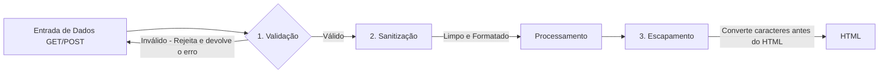
---
1. **Validação:** Verifica se o dado recebido atende aos requisitos exatos do sistema (tipo, tamanho, formato).

- **Exemplo:** Verificar se o email possui `@` e domínio válido (`filter_var($email, FILTER_VALIDATE_EMAIL)`).
---
2. **Sanitização:** Transforma o dado para adequá-lo ao formato desejado, removendo caracteres indesejados.

- **Exemplo:** Remover espaços no início e fim (`trim($nome)`).
---
3. **Escapamento/Codificação de Saída:** É o ato de converter caracteres especiais de linguagem HTML em suas respectivas ***Entidades HTML*** no momento exato em que eles são impressos na tela.

- **Exemplo:** Usar `htmlspecialchars()`.
---
### A Ferramenta Principal: `htmlspecialchars()`

A função `htmlspecialchars()` é o principal mecanismo do PHP para neutralizar XSS na camada de apresentação.

---
**Como a conversão de entidades funciona:**

| Caractere Original | Entidade HTML Gerada | Efeito no Navegador |
| :---: | :---: | :--- |
| `<` | `&lt;` (*Less Than*) | O navegador exibe `<` na tela, mas **não cria uma tag**. |
| `>` | `&gt;` (*Greater Than*) | O navegador exibe `>` na tela sem fechar tags. |
| `"` | `&quot;` (*Quotation Mark*) | Não quebra atributos HTML `<input value="...">`. |
| `'` | `&#039;` ou `&apos;` | Protege strings envoltas em aspas simples. |
| `&` | `&amp;` (*Ampersand*) | Evita interpretação incorreta de entidades. |
---
**A Sintaxe no PHP**

```php
string htmlspecialchars(
    string $string,
    int $flags = ENT_QUOTES | ENT_SUBSTITUTE | ENT_HTML5,
    ?string $encoding = "UTF-8"
);
```

- `ENT_QUOTES`: Converte tanto aspas duplas (""), quanto aspas simples (''). Essencial para saídas em atributos HTML.
- `ENT_SUBSTITUTE`: Substitui sequências de bytes inválidos por caracteres de substituição Unicode em vez de retornar uma string vazia.
- `ENT_HTML5`: Aplica a tabela de entidades compatíveis com a especificação HTML5.
- `UTF-8`: Garante que caracteres da língua portuguesa (como "ç", "ã", "é") sejam preservados sem corrupção.
---
**A Função Helper de Escapamento**

Para não precisar digitar essa linha extensa em todas as partes de saída de texto para HTML, os desenvolvedores profissionais criam uma função auxiliar curta:

```php
function e(string $texto): string {
    return htmlspecialchars($texto, ENT_QUOTES | ENT_SUBSTITUTE | ENT_HTML5, "UTF-8");
}

<p>Comentário: <?= e($comentarioUsuario) ?></p>
<input type="text" name="nome" value="<?= e($nomeUsuario) ?>">
```
---
### Validação e Sanitização com `filter_var`

O PHP possui a biblioteca de filtros nativos `filter_var()`. Observe os filtros mais importantes do ecossistema corporativo:

```php
<?php
declare(strict_types=1);

// 1. Validação de E-mail
$email = "usuario.teste@senai.br";
if (filter_var($email, FILTER_VALIDATE_EMAIL) !== false) {
    // E-mail válido
}

// 2. Validação de Número Inteiro com Limites (Range)
$idade = "25";
$opcoesIdade = [
    'options' => [
        'min_range' => 16,
        'max_range' => 120
    ]
];
if (filter_var($idade, FILTER_VALIDATE_INT, $opcoesIdade) !== false) {
    // Idade é um inteiro entre 16 e 120
}

// 3. Validação de URLs (Links)
$website = "https://www.sp.senai.br";
if (filter_var($website, FILTER_VALIDATE_URL) !== false) {
    // URL possui protocolo e formato válidos
}

// 4. Validação de Endereço IP
$ip = "192.168.1.100";
if (filter_var($ip, FILTER_VALIDATE_IP) !== false) {
    // IP válido
}
```
---
---
## SEMANA 8 - Persistência de Dados com Banco de Dados Relacionais (PostgreSQL) e Conexão PDO

**Temas:**
- Camada de acesso a dados
- DriverPDO (PHP Data Objects)
- Driver `pdo_pgsql`
- Padrão Singleton
- Isolamento de Credenciais (`.env` / `.ini`)
- Tratamento de Exceções (`PDOException`)
---
### 1. Da *memória volátil* ao *banco de dados*

Em sistemas corporativos de grande porte, arquivos planos (`.txt` / `.json`) não oferecem a segurança, integridade, concorrência e velocidade necessárias para o armazenamento de dados. Então é aqui que o ***BackEnd*** encontra o **Banco de Dados Relacional**.

O **Banco de Dados Relacional** permite:
- Conectar a lógica de programação server-side ao Sistema de Gerenciamento de Banco de Dados (SGBD).
- Garantir persistência definitiva e segura dos registros.
- Aplicar integridade referencial, constraints, consultas otimizadas e produtividade ACID aprendidas na disciplina de Banco de Dados.
> **OBS:**
***ACID***
> - **Atomicidade:** assegura que cada transação seja única.
> - **Consistência:** respeita todas as regras, restrições e chaves definidas, garantindo a validade da transação.
> - **Isolamento:** transações são realizadas de forma independente.
> - **Durabilidade:** transações são confirmadas, garantindo persistência permanente.
---
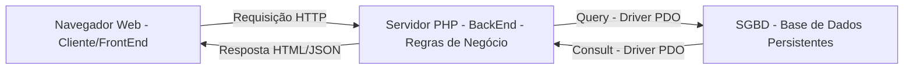
---
### 2. O que é o *PDO (PHP Data Object)*?

O **PDO** é uma camada de abstração de acesso a dados integrada nativamente ao PHP. Ele fornece uma interface uniforme e orientada a objetos para se comunicar com múltiplos sistemas de banco de dados *(PostgreSQL, MySQL, SQLite, OracleSQL, SQLServer)*.

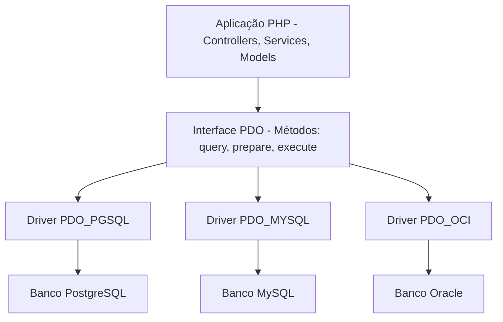
---
### 3. Vantagens do uso do *PDO*

- **Portabilidade de Código:** Os métodos de conexão, consulta e transações são idênticos, independente do banco utilizado. Se o cliente migrar do banco *Postgres* para outro SGBD(*MySQL*), o programador apenas altera a string DSN de conexão, preservando toda a lógica de acesso já utilizada ou criada.
- **Suporte Nativo a Prepared Statement:** O *PDO* foi projetado para trabalhar com consultas nativas, oferencendo defesa contra ataques de ***SQL_Injection***.
- **Tratamento Orientado a Objetos com Exception:** Em vez de retornar códigos de erros, o *PDO* lança uma instância da classe especializada `PDOException`.
---
#### **A Sintaxe da Conexão *PDO*: ***DSN (Data Source Name)*****

Para que o *PDO* saiba onde o banco está localizado e em qual porta abrir, utilizamos a string padronizada ***DSN***.

```text
pgsql:host=127.0.0.1;port=5432;dbname=seu_banco
  |          |            |           |
  |          |            |           └─ Nome da base de dados ralacional(nome do banco)
  |          |            └─ Porta padrão do Banco de Dados PostgreSQL(5432)
  |          └─ Endereço IP ou hostname do servidor
  └─ Identificador do driver do SGBD(pgsql) - PostgreSQL
```
---
### 4. Configuração do *PDO*

Ao instanciar um objeto PDO, devemos configurar quatro flags essenciais que determinam como o driver se comportará frente a erros e consultas ao SGBD.

```php
$opcoes = [
    //1. flag: Lança exceções imediatamente quando ocorrer qualquer erro SQL
    PDO::ATTR_ERRMODE => PDO::ERRMODE_EXCEPTION,

    //2. Retorna registros apenas com nomes das colunas (eliminar duplicidade numérica)
    PDO::ATTR_DEFAULT_FETCH_MODE => PDO::FETCH_ASSOC,

    //3. Desativa a emulação e utiliza prepared statements nativos do SGBD
    PDO:: ATTR_EMULATE_PREPARES => false,

    //4. Limita um tempo de 5 segundos para tentar a conexão com o servidor do BD
    PDO:: ATTR_TIMEOUT => 5
];
```
---
#### **Detalhamento das Flags:**

- **PDO::ATTR_ERRMODE => PDO::ERRMODE_EXCEPTION** : por padrão, o PDO pode falhar silenciosamente e retornar apenas `false`. Ao Ativar o `ERR_MODE`, ele força o PHP a disparar uma `PDOException`, permitindo que o nosso código interprete qualquer erro em um bloco `try-catch`.

- **PDO::ATTR_DEFAULT_FETCH_MODE => PDO::FETCH_ASSOC** : por padrão, o método `fetch()` retrona um array duplicado contendo índices numéricos `[0,1]` e associativos `["id","código_maquina"]`. Definir `FETCH_ASSOC` reduz o consumo de memória RAM pela metade e entrega coleções limpas.

- **PDO::ATTR_EMULATE_PREPARES => false** : Garante que o PHP envie a consulta e os parâmetros separados diretamente para o planejador do BD processar, blindando a aplicação contra ataques sofisticados de `SQL_injection`.
---
### 5. Proteção de Credenciais

Um dos erros mais graves cometidos por desenvolvedores iniciantes é escrever dados de conexão diretamente dentro do código:

```php
// péssima prática de código
$pdo = new PDO ("pgsql:host=localhost; dbname="producao"; "postgres"; "senha12345"");
// observa-se que as credenciais estão expostas no código
```
Se esse arquivo for versionado e enviado para o GitHub:
1. Suas senhas de produção ficam públicas.
2. Robôs maliciosos varrem repositórios à procura de credenciais expostas, para invadir bancos de dados e sequestrar informações *(ataque de Ransomware)*.
3. A empresa é penalizada por violações da *LGPD (Lei Geral de Proteção de Dados)*.
---
#### **Abordagem segura: usando arquivos de configuração isolada (`.env` / `.ini`)8**

Isolamos as credenciais em um arquivo externo protegido que ***nunca entra no Git***.

```ini
; config/database.ini
[database]
db_driver = pgsql
db_host = 127.0.0.1
db_port = 5432
db_name = producao
db_user = postgres
db_pass = senha12345
```
> Adicionamos o arquivo isolado ao `.gitignore`

```text
config/database.ini
.env
logs/*.log
```
---
### 6. Padrão Singleton de Conexão

Imagina uma aplicação web com 500 usuários acessando simultaneamente. Se cada script, função ou método executar `new PDO()`, ou seja, abrir uma nova conexão, sempre que precisar consultar o banco de dados, teremos milhares de conexão de redes abertas desnecessariamente.

No **SGBD *(PostgresSQL)***, cada conexão aberta cria um processo no sistema operacional dedicado. Abrir conexões repetidas esgota rapidamente o limite configurado (`max_connection`) do BD, gerando um erro:
> `Fatal Error: Sorry, too many clients already`
---
#### **Como o Singleton resolve isso**

O padrão ***Singleton*** garante que **apenas uma única instância de conexão PDO exista por requisição**, reutilizando a conexão existente em qualquer ponto do sistema.

---
#### **Configurações do Singleton**

1. **Construtores Privados (`private function_constructor`):** Impede que outros arquivos instanciem uma nova conexão.
2. **Propriedades (ou Atributos) Estáticas Privadas (`private static ?PDO $instancia = null`):** Armazena a conexão aberta na classe.
3. **Métodos de Acesso Estático Públicos (`public static function obterConexao():PDO`):** A conexão é criada pelo método, garantindo acesso a conexão, mas não acesso aos atributos da conexão. Se caso já existir uma conexão, apenas devolve a conexão existente para o operador, sem a necessidade de criar uma nova.
4. **Bloqueio de Clonagem e Desserialização (`_clone` e `_wakeup`):** Garante que ninguém consiga duplicar o objeto da conexão.
---
### 7. Tratamento de Falhas com `PDOException`

Quando uma tentativa de conexão falha (servidor desligado, senha incorreta, usuário incorreto, porta inacessível...), o PDO lança uma exceção (`PDOException`). Então, devemos tratar essas falhas.

---
#### **Práticas recomendadas de segurança (AppSec):**

- **Para o Usuário:** Exibir mensagens amigáveis e genéricas (*"Não foi possível processar sua solicitação. Tente novamente mais tarde"*).
- **Para a Equipe de Desenvolvimento:** Gravar os detalhes técnicos da falha com *timestamp* (carimbo de data e hora) em um arquivo de log seguro (`log/database.log`);